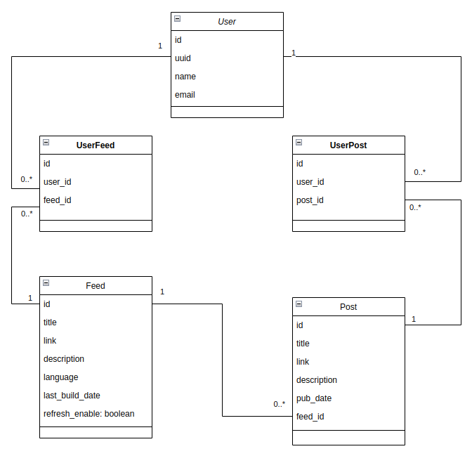

# rss-reader

Web service which provides an API to interact with multiple RSS feeds and a background
process to fetch the most recend feeds registered on our database.

## System Design
The classes have beens designed as shown in the diagram below:



- A post points to a unique feed and a feed can have multiple posts.
- A user can follow or unfollow a post. Hence, a register on the N-N table `UserFeed`
represents a subscription of a user to a post, and a removal represents the unfollow
action.
- A user can mark a post as read. Hence, when it happens we add a register on the N-N
table `UserPost`, and its removal represents the inverse (unread).

Based on this design we have the system divided in two parts:

**Background Process:**
- Implemented with [Celery](https://docs.celeryq.dev/en/stable/index.html) and [RabbitMQ](https://www.rabbitmq.com/)
  to perform the asynchronous processing of feed refresh.
- Routine (every 5 minutes) to trigger a refresh on all feeds which are "refreashable"
  (default=True), which means querying their URL, parsing 
  its information and inserting the posts related to the feed. Each feed refresh is 
  performed by an isolated task, which can be processes in parallel by multiple
  workers.
- In case of failure on a feed refresh, the system provides 3 retries with a back-off
  mechanism of 2, 5 and 8 minutes between retries. If the task reach the max retries
  without success it will try to refresh on the next routine scheduled by the system (in 5 minutes).


**API**
- Endpoints for the user to perform the actions of follow/unfollow a feed or
  mark a post as read/unread.
- Endpoint to force a feed refresh (synchronously)
- Endpoint to list posts using filters (read/unread, by feed)
- Implemented with [FastAPI](https://fastapi.tiangolo.com/) framework
- Offers an OpenAPI documentation for the API where you make requests to the available endpoints
  using the browser and explore details of each endpoint (request/response schemas).
  You can check how to access it on the section "Running the application".

## Installation
Requirements: Python 3.11+

Open a terminal and follow the instructions:

Create a virtual environment and activate it:
```commandline
python3 -m venv venv/
source venv/bin/activate
```

Install poetry (manage ours dependencies) and install the project:
```commandline
pip install -U pip poetry==1.4.2
poetry install
```

## Running the application

Step 1 - Start a container with PostgreSQL:
```commandline
docker container run -d -p 5435:5432 --name pgsql -e POSTGRES_PASSWORD=postgres postgres:15.2
```

Step 2 - Enter the `pgsql` container and the databases manually:
```commandline
docker exec -it pgsql bash
su -l postgres -c psql
CREATE ROLE dbadmin WITH LOGIN PASSWORD 'dbadmin';
CREATE DATABASE  rss_reader OWNER dbadmin;
CREATE DATABASE  rss_reader_test OWNER dbadmin;
```
The `rss_reader` is used by the application and the `rss_reader_test` is used
only to run the tests.

Step 3 - On another terminal, create the tables with alembic on database `rss_reader`:
```commandline
alembic -c alembic.ini upgrade head
```

Step 4 - Add some initial data by running the script initialize_db.py:
```commandline
python initialize_db.py
```

Step 4 - Start a container with the rabbitmq broker, sob the beat can add messages
and the celery worker would be able to get them and process:
```commandline
docker run -d -p 5672:5672 --name rabbitmq-broker rabbitmq
```

After all this set up you can run the different processes in different terminals:
- Web application (access the swagger with the API on http://localhost:8000/docs)
    ```commandline
    uvicorn app.main:app --reload
    ```
- Celery worker
    ```commandline
    celery -A app.worker worker -l INFO
    ```
- Celery beat
    ```commandline
    celery -A app.worker beat -l INFO
    ```

## Running Tests
On a terminal execute:
```commandline
pytest -v
```